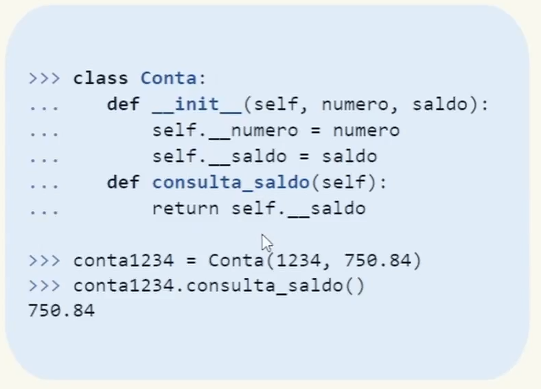

# Os 4 Pilares da Orientação a Objetos

  

---
- Classes e objetos
    - Em POO, as classes estão para objetos assim como formas estão para bolos.
    - Podemos criar vários objetos a partir de uma mesma classe, mas, assim como cada bolo tem um sabor, cada objeto terá sua própria identidade.
    - Classe é uma estrutura de dados que une variáveis (propriedades) e funções (comportamentos).

- Os 4 pilares
    - Encapsulamento
        - Encapsulamento é um recurso da orientação a objetos que permite agrupar um código e os dados por ele manipulados em uma única entidade, protegendo-os de interferências externas, acesso indevido e/ou utilização/modificação inadequada por outro trecho de código definido fora do código encapsulado.

        

        

    - Abstração
        - Uma classe abstrata deve conter pelo menos um método abstrato, e podemos criar uma classe abstrata herdando da superclasse para classes abstratas ABC (abstract base classes), do módulo abc. 

        

    - Herança
        - A herança permite que as características e os comportamentos descritos de uma classe “pai” (superclasse) sejam herdados por sua classe “filha” (subclasse).

        

        

        

    - Polimorfismo
        - Polimorfismo é a capacidade de um objeto poder ser referenciado de várias formas (o que não significa que o objeto pode se transformar em outro tipo).

        

        
---

  

