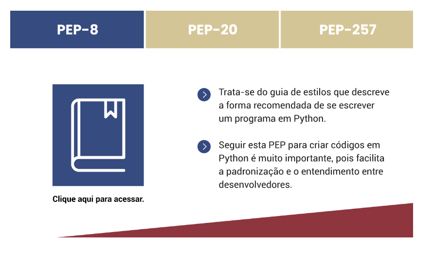
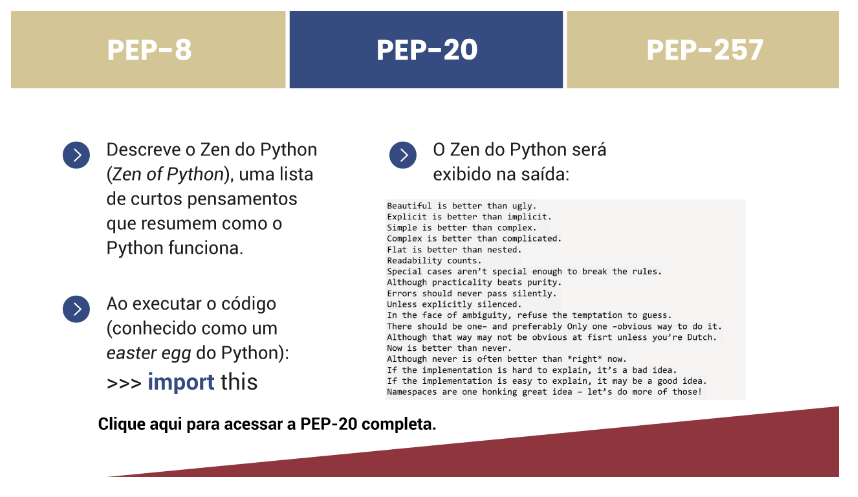
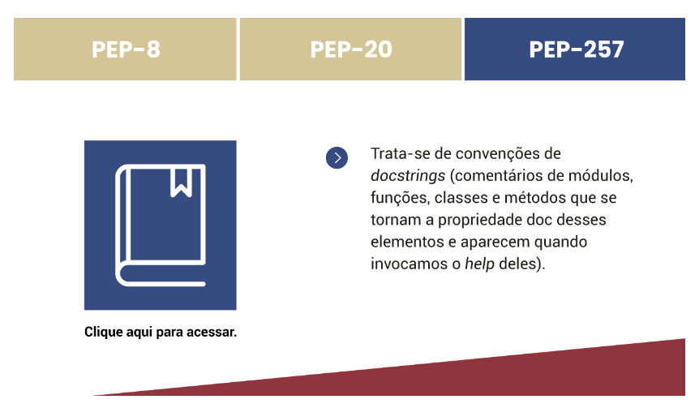
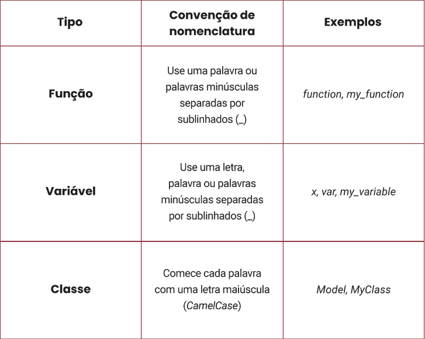
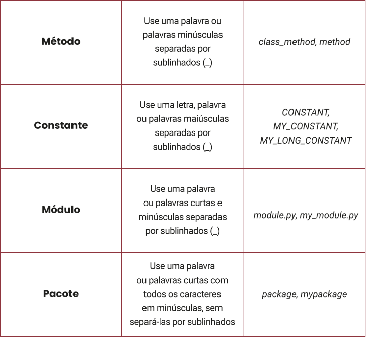

# Boas Práticas de Orientação a Objetos e de Codificação em Python
---
- Princípios SOLID
    - Single responsibility principle (SPR) – Princípio de responsabilidade única
    
    - Open/closed principle (OCP) – Princípio do aberto/fechado
    
    - Liskov substitution principle (LSP) – Princípio da substituição de Liskov
    
    - Interface segregation principle (ISP) – Princípio de segregação de interface
    
    - Dependency inversion principle (DIP) – Princípio da inversão de dependência
---
- Guia de Estilos
    - PEP-08
        

    - PEP-20
        

    - PEP-257
        
---
- Nomenclatura
    
    
---
