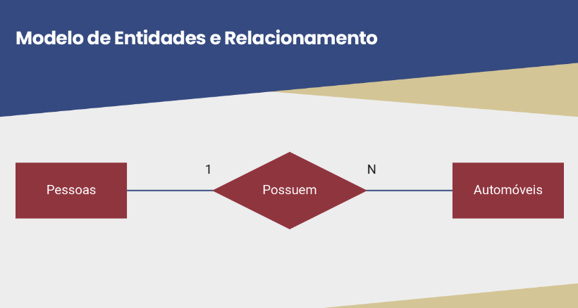

# Bancos de Dados: Fundamentos, Modelos, Arquiteturas de Sistemas e SQL Básico
---
- Sistemas de bancos de dados
    - Um conjunto de dados relativamente organizado e estruturado para satisfazer algumas demandas de aplicações específicas.
    - Lida com grande volumes de dados
    - Persistência de grande quantidade de dados

    

---
- Modelos de dados
    - Pode-se partir de modelos mais distantes da implantação de um sistema, os chamados modelos de dados conceituais, até os modelos de dados de implementação, que podem incluir a escolha de um SGBD específico, e que têm a preocupação de representar os dados de tal maneira que incluem alguns requisitos de desempenho.
---
- Modelo de dados relacional
    - O modelo relacional (relational data model) contempla as duas partes que compõem qualquer modelo de dados: estrutura, no caso relações matemáticas, e o manuseio por meio de linguagens (por exemplo, SQL ou álgebra relacional) projetadas para estruturas relacionais.
    - Sua estrutura se baseia em abstrações matemáticas chamadas de relações.
---
- Estrutura do modelo de dados relacional
    - A parte estrutural do modelo relacional é baseada no conceito matemático de relações, que tem, por sua vez, muitas semelhanças com o conceito matemático de conjunto. 
    - Mais formalmente, um elemento de uma relação é chamado de tupla, que é representada como uma linha de uma tabela. Uma tupla é um conjunto não ordenado de valores, um para cada coluna. Cada valor é derivado do seu domínio apropriado. Uma relação pode ser vista como um conjunto de tuplas, ou um conjunto de linhas. Colunas numa tabela são, formalmente, atributos nas relações. Para facilitar a compreensão da noção das tuplas ou t-uplas, se fossem duas ou três colunas poderíamos dizer duplas ou triplas, respectivamente.
    - A ordenação dos atributos numa relação `R (A1, A2, ..., An)` com N atributos pode ser qualquer, mas deve ser definida, e os valores em cada tupla `t = <v1, v2, ..., vn>`, onde v1 ∈ A1, ... vn ∈ An são considerados ordenados.
---
- Definindo relações
    - As linhas de uma tabela formam um subconjunto do produto cartesiano dos domínios de cada coluna.
---
- Outras características de relações
    - Não têm elementos repetidos. Como as linhas de uma tabela no modelo relacional não têm identificação própria, só podemos nos referir às tuplas pelos valores em seus atributos.
---
- Esquemas de bancos de dados relacionais
    - Seja R (A1, A2, .........., An) uma relação com n atributos, ou seja, cada linha de R conterá n colunas. R é chamado de esquema da relação, enquanto uma instância de R é um conjunto específico de valores usados para popular a tabela R.
---
- Manuseio de dados no modelo relacional
    - O acesso e manipulação de dados através da linguagem SQL é realizado de forma declarativa. Ou seja, quando realizamos uma consulta com SQL, não precisamos especificar como o gerenciador irá obter os dados desejados. De fato, precisamos apenas definir o que desejamos que seja retornado a partir da consulta.
---
- SQL: a linguagem relacional-padrão
    - 

