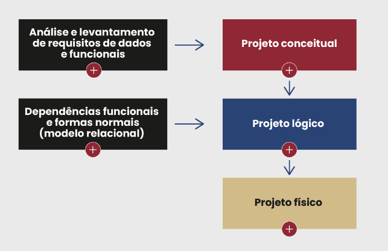
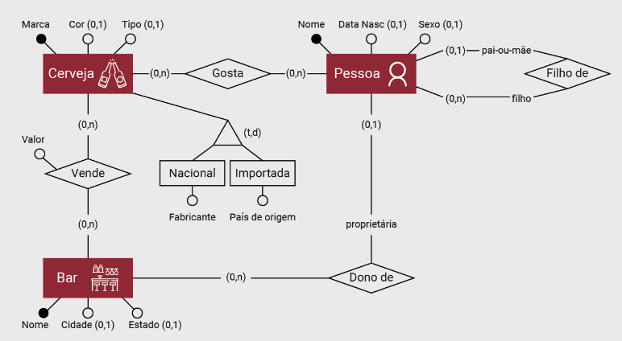
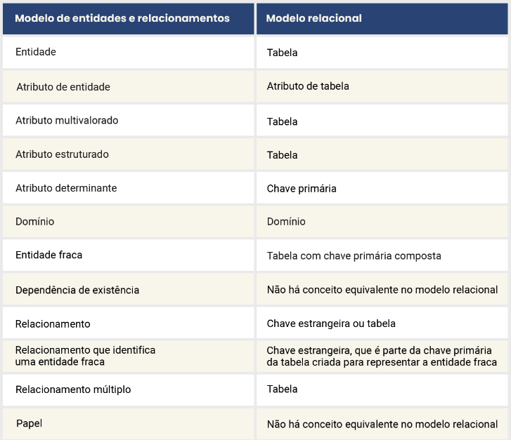
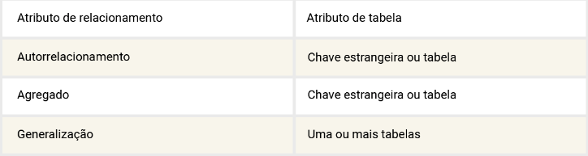
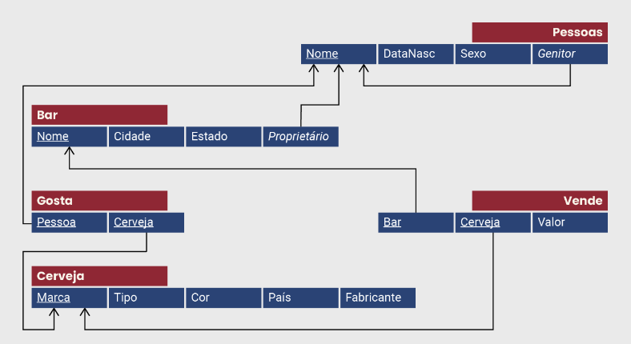
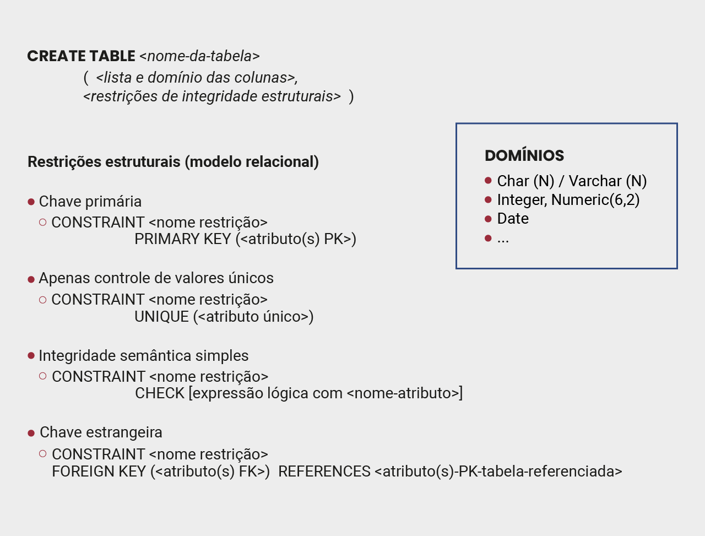
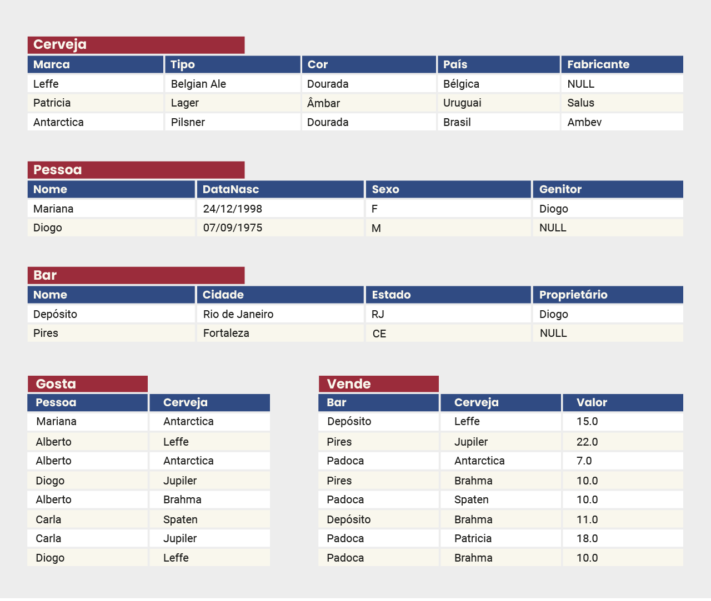
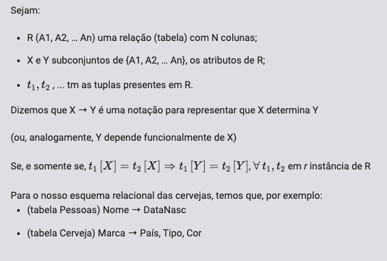

# Bancos de Dados: Projeto Conceitual e Lógico, SQL DDL (esquemas) e SQL LMD (instâncias)
---
- Processo de modelagem conceitual
    - Para qualquer modelo lógico, não apenas relacional, sugere-se elaborar um modelo estritamente conceitual que contemple todos os dados do banco e a maneira como que esses dados se relacionam.

    

---
- Entidades e atributos
    - A modelagem por entidades e relacionamentos tem alto grau de abstração e foi proposta com o intuito de capturar a semântica de aplicações do mundo real. É um modelo simples, intuitivo, mas formal, que define como representar dados e relacionamentos entre estes, com regras e especificações que devem ser satisfeitas para que a modelagem possa ser considerada correta.
    - 3 tipos de objetos a modelar
        - Entidades
        - Relacionamentos
        - Atributos
    - Como forma de linguagem, adota-se na prática uma representação visual conhecida como diagrama de entidades e relacionamentos (DER), que facilita o uso da modelagem e as trocas entre usuários-desenvolvedores e usuários não técnicos.
    
    
---
- Relacionamentos e hierarquias entre entidades
    - Como o próprio nome diz, em um MER temos entidades e relacionamentos. Os losangos utilizados no DER representam os relacionamentos entre ocorrências de entidades ou, genericamente, relacionamentos entre entidades.
    - Se observarmos o diagrama sobre cervejas, temos um relacionamento denominado “Dono de” entre as entidades Pessoa e Bar. Ele significa que determinada pessoa pode ser dona, ou proprietária, de algum bar. Relacionamentos são descritos adicionalmente por meio de cardinalidades mínimas e máximas.
    - Relacionamentos
        - N X N
            - Também chamado de “N para N” ou “muitos para muitos”, serve para representar casos em que podemos ter mais de uma ocorrência de uma entidade se relacionando com mais de uma ocorrência da outra entidade. No caso das cervejas, temos, por exemplo, o relacionamento Gosta, que representa o fato de cada pessoa poder gostar de mais de uma cerveja e, também, que uma cerveja pode ser apreciada por mais de uma pessoa
        - 1 X N 
            - Conhecido também como “1 para N” ou “1 para muitos”, permite modelar casos em que apenas uma das entidades tem múltiplas ocorrências se relacionando com apenas uma ocorrência da outra entidade. Uma pessoa pode ser proprietária de mais de um bar, porém cada bar pode ter apenas um proprietário.
        - 1 X 1 
            - Note que, assim como para as entidades, a modelagem ER permite atributos também para relacionamentos. No exemplo do esquema conceitual ER das cervejas, o atributo Valor do relacionamento Vende permite especificar o preço que cada bar vende suas cervejas. Esse atributo não é nem da entidade Bar, pois não faz parte dos conceitos que descrevem um bar, nem é atributo da entidade Cerveja, pois cada marca pode ter um valor de venda diferente em cada bar em que é vendida.
---
- Mapeamento MER para modelo relacional
    
    

    - Note que na Figura 2.03, cada tabela tem sua própria chave primária (PK), e algumas podem ter também chaves estrangeiras (FK). As PKs estão sublinhadas: no caso da tabela Cerveja, é a coluna Marca, e, para a tabela Gosta, é uma chave (composta!) das colunas Pessoa e Cerveja. Já as integridades referenciais das FKs são apontadas pelas linhas com setas indicando quais atributos referenciam ou são referenciados. Por exemplo, a coluna Cerveja é FK na tabela Vende referenciando a coluna Marca na tabela Cerveja, assim como o atributo Proprietário na tabela Bar referencia o atributo Nome na tabela Pessoa.

    
---
- Criando tabelas com a linguagem SQL

    
---
- Manuseio de dados nas tabelas
    
---
- Teoria da normalização
    - Dependência funcional
        - dependências funcionais são restrições sobre os atributos e tuplas em todas as tabelas de um banco de dados relacional que devem ser validadas para qualquer instância.Para qualquer esquema relacional, como é o caso do esquema das cervejas, teremos um conjunto F de dependências funcionais (DF) contemplando os diversos atributos ou colunas das tabelas. 
        
    