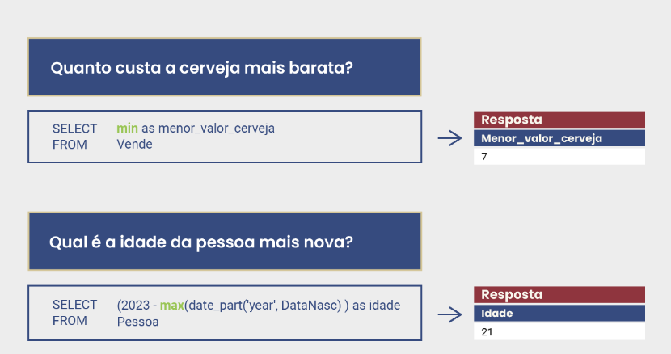
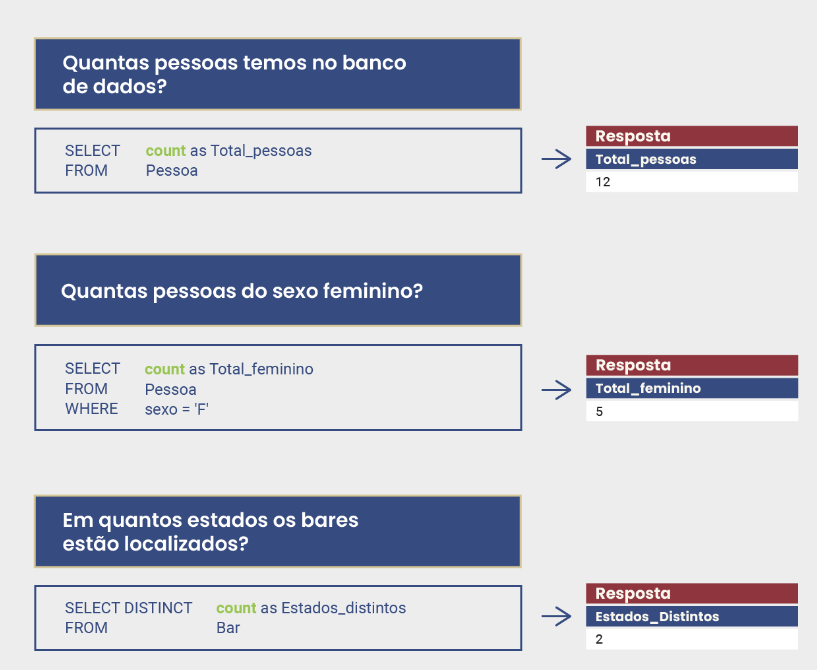
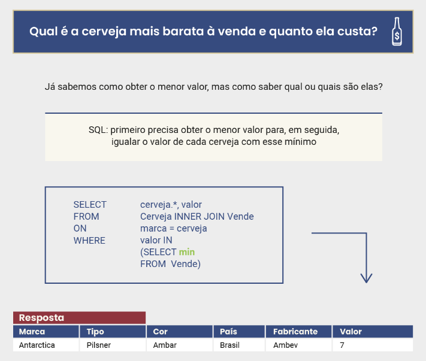
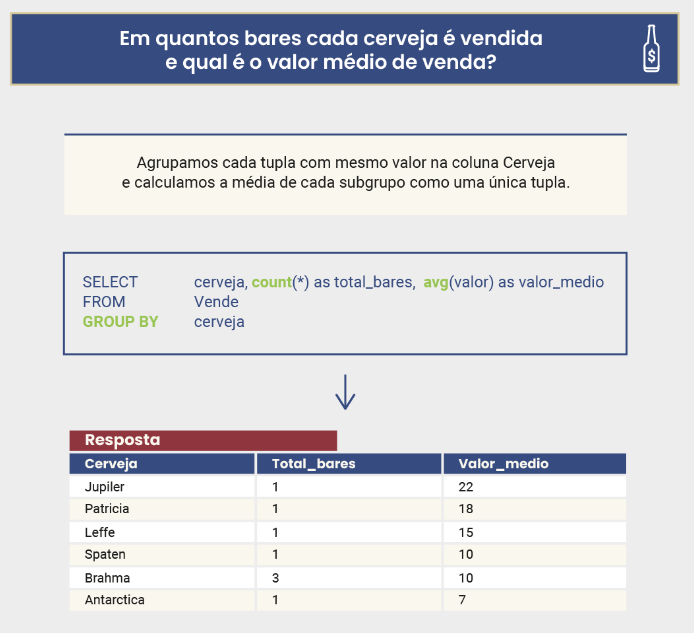
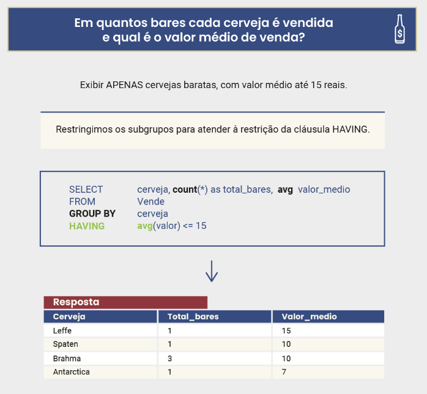
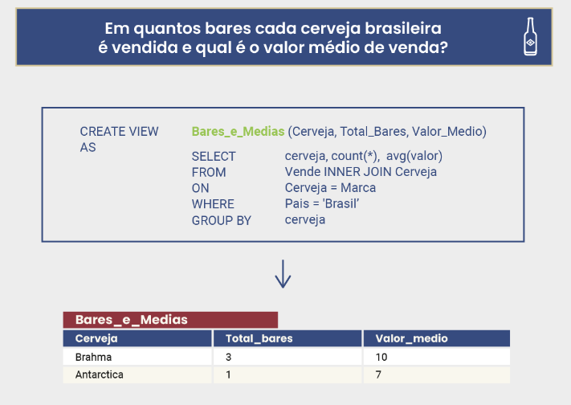
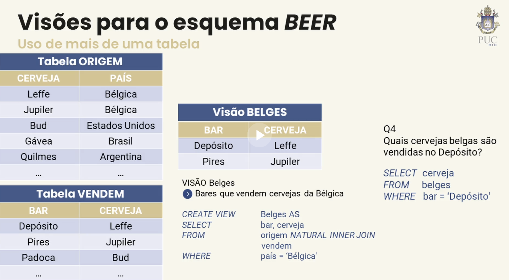

# Banco de Dados: Complemento SQL DML, Consultas e Visões Relacionais, Índices e Projeto Físico 
---
- Junções relacionais
    - Após combinar todas as tuplas de uma tabela com as tuplas da outra, a saída do operador corresponde apenas às tuplas que retornam como verdadeira a comparação de igualdade entre atributos que é explicitada.
    - A operação de junção interna também é normalmente chamada apenas de “junção”. Entretanto, existe outro tipo de junção, chamado de junção externa, e, por isso, a junção “normal” também é conhecida como interna. Essa junção externa (OUTER JOIN, do inglês) é similar à junção interna, mas considera, para fins de resultado na saída, as tuplas que se combinam na junção com outras que não se combinam.
---
- Aliases ou apelidos para tabelas e atributos
    - A linguagem SQL permite o uso de aliases (ou apelidos) tanto para desambiguar atributos como para simplificar a maneira de expressá-los nas consultas.
---
- Uso de funções em tabelas
    - SUM: Somando

    

    - COUNT: Contando o total

    

    - INNER JOIN: Uninddo tabelas

    

---
- Funções e agregados: cláusula Group By
    - GROUP BY: Unindo por grupo

    

    - HAVING: restringindo valores

    

---
- Visões relacionais (Tabelas Virtuais)
    - Existe um objeto conhecido como visão (ou view, em inglês), que permite guardar no catálogo do banco as definições de consultas para uso posterior.
    - Muitas vezes as visões são chamadas de tabelas virtuais, pois os dados não são armazenados, apenas a consulta que define a visão. Uma vez definida uma visão, esta pode ser usada para definir outras visões, e assim por diante.
    
     

    - Consultas com e sem visões

    

    - Consultas com visões e mais de uma tabela

    

---
- Índices em bancos de dados relacionais
    - 