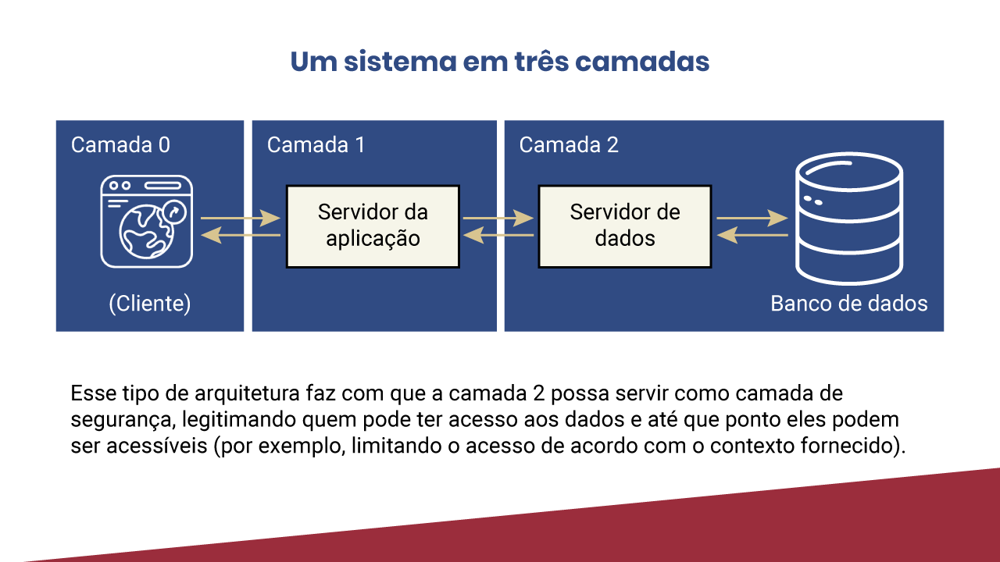

# Primeiros passos no desenvolvimento de um sistema web
---
- O início da web e seus desafios
    - A internet foi criada em 1969, pela Darpa, a Agência de Projetos de Pesquisa Avançada de Defesa dos Estados Unidos. Sendo assim, tinha inicialmente um propósito mais voltado para a área militar. Mais de vinte anos depois surgiu a primeira página web, em 1991, em um centro de pesquisa em Genebra, com o propósito de facilitar o compartilhamento de conhecimento via internet.

    - O projeto que definiu a web que conhecemos atualmente começou em 1990, na Organização Europeia para a Pesquisa Nuclear (CERN). À época, seu nome era WorldWideWeb, hoje apenas WWW (o famoso www no início da maioria das páginas web). O pai do projeto foi o britânico Tim Bernes-Lee, que não só criou a web como também pavimentou o caminho para sua evolução. Clique na seta e veja as outras criações do Tim Bernes-Lee:

        
        
        

        

        

        

        

        

    - Para contornar esse cenário, em 1993, Roy Fielding, cofundador do Apache HTTP Server Project, propôs um caminho para a continuidade da expansão da web. Sua proposta era que a escalabilidade da web fosse governada por um conjunto de key constraints (restrições/limitações-chave). Segundo ele, a continuidade da expansão seria possível se cada uma dessas restrições fosse atendida de forma igual.

    - Essas restrições/limitações ainda são válidas e devem ser observadas e atendidas no desenvolvimento de qualquer sistema web (COOKSEY, 2014). Fielding as categorizou em seis grupos:

        
---
- Cliente-servidor
    - Separação de responsabilidades na web entre aplicações cliente e servidor.

---
- Uniformidade de interfaces
    - A comunicação entre aplicações depende da uniformidade de suas interfaces, ou seja, a forma de comunicação deve ser conhecida entre as partes. 

        
---
- Sistema em camadas
    - A restrição de arquitetura em camadas também pode servir para outros propósitos. Por exemplo, na imagem a seguir, temos um sistema em três camadas: o cliente (representado pelo browser) está na camada 0; o servidor da aplicação está na camada seguinte; e o acesso aos dados só é possível na terceira camada. Nessa arquitetura, o cliente não tem acesso direto aos dados, pois não estão em camadas vizinhas. 

        
---
- Cache
    - O objetivo dessa restrição é exigir da aplicação servidor que declare se o dado enviado em uma resposta a uma requisição é “cacheável”, ou seja, se pode ser armazenado em memória para evitar que outra requisição que o peça seja feita em curto prazo de tempo.

    - O cache de uma resposta pode ajudar na “percepção de latência” do cliente, aumentando a disponibilidade de um recurso e reduzindo a carga do servidor da aplicação.
---
- Stateless (ausência de estado - cliente envia todas as informações)
    - Essa restrição de arquitetura determina que um servidor web não necessita memorizar os estados da aplicação cliente. Como resultado, o cliente deve incluir toda informação de contexto que possa ser considerada relevante na requisição, para qualquer iteração com o servidor. Livre dessa preocupação, um servidor pode atender a diferentes clientes de forma ágil.
---
- Code-on-demand
    - Essa restrição de arquitetura da web permite que servidores possam enviar pequenos trechos executáveis de código, como scripts e plug-ins, para clientes. O objetivo é permitir que a aplicação servidora possa oferecer um meio para a aplicação cliente interpretar um dado enviado. Com isso, o código enviado habilitaria o cliente a interpretar o dado enviado pelo servidor.

    - Essa restrição é a única que pode ser considerada opcional entre todas as apresentadas. Ela é muito comum quando se utilizam tecnologias como Java Applets e JavaScripts.
---
- O protocolo HTTP
    - O protocolo HTTP é um dos mais adotados no desenvolvimento de sistemas web. Um de seus benefícios é a facilidade de aprendizado. Além disso, apresenta uma série de funcionalidades nativamente aderentes às restrições de arquiteturas.

    - Para fazer uma requisição em HTTP a aplicação cliente precisa informar:

        

    - Http Status e seus significados:

        
---
- Padrões de arquitetura em sistemas web
    - Os aspectos são:

        

    - Na proposta a seguir de arquitetura, duas aplicações do lado do servidor, em duas camadas diferentes, tratarão de responsabilidades específicas: uma servirá a apresentação (front-end) e a outra fará a execução de lógicas de negócio e o envio de dados.

        
---
- Padrão MVC
    - Model View Controller

        