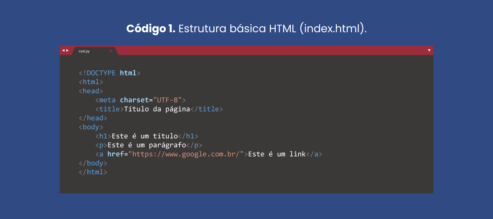
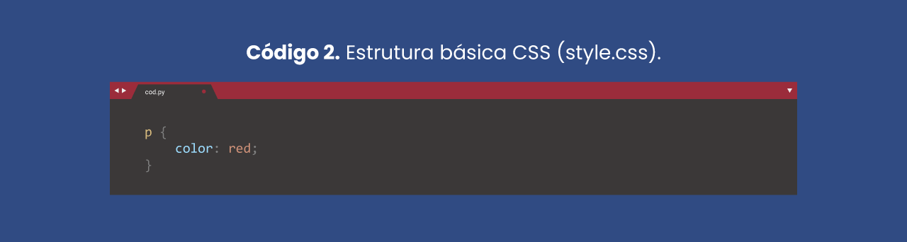
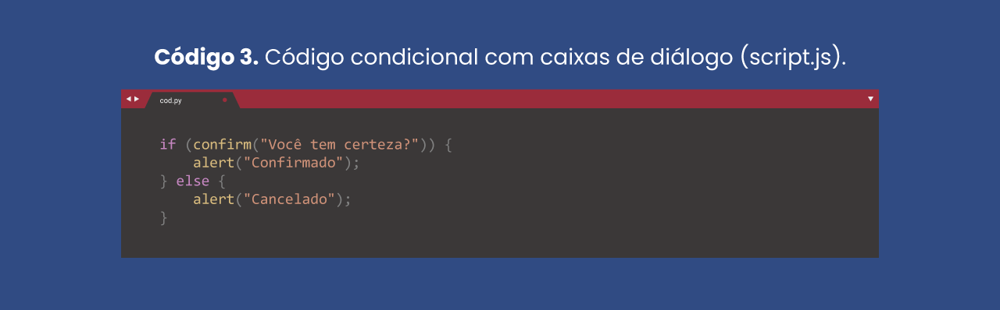
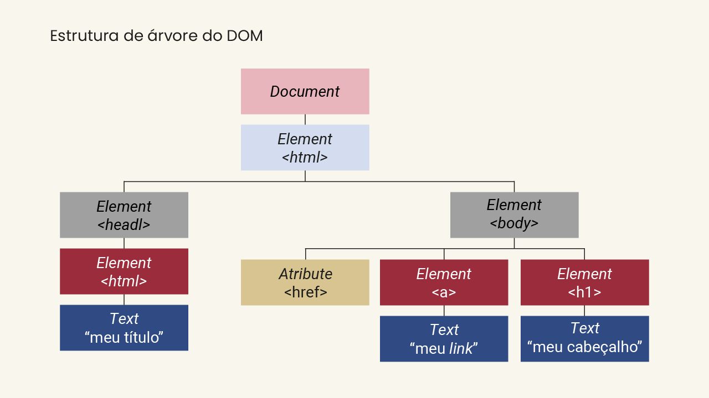

# Implementando um projeto de interface
---
- O HTML
    - O HTML é uma combinação de textos com códigos especiais (tags ou etiquetas).
    - As tags possibilitam a estruturação do conteúdo do documento e dão instruções ao navegador sobre o que deve ser feito
    - Elas são declaradas entre parênteses angulares (‘<’ e ‘>’), e a maioria das tags tem sua correspondente de fechamento (que terá uma barra comum: < /nomedatag >).
    - Estrutura básica de um arquivo HTML

        
    
    - Visualização de uma página HTML em um navegador

        

---
- CSS
    - O CSS é uma linguagem de folha de estilo que é aplicada para definir como os elementos HTML devem ser apresentados em uma página da web em termos de design, layout e variações para diversos dispositivos com diferentes tamanhos de tela.
    - O CSS possibilita personalizar fontes, cores, margens, linhas, alturas, larguras, imagens de fundo, posicionamentos e outras tantas características a elementos de documentos codificados em HTML.
    - Estrutura básica de um aquirvo CSS

        

    - O CSS pode ser incorporado dentro do código HTML, porém geralmente, e por boas práticas, ele é escrito em um arquivo .css, facilitando a manutenção.
    - Para introduzir esse arquivo no Código 1, é necessário adicionar a tag <link> e seus atributos dentro da <head>. Essa tag define o relacionamento entre o documento atual e um recurso externo.
---
- JavaScript
    - JavaScript é uma linguagem de programação leve, interpretada, orientada a objetos, baseada em protótipos e em first-class functions (funções de primeira classe), mais conhecida como a linguagem de script da internet.
    - Como uma linguagem de programação dinâmica, o JavaScript não precisa ser executado por meio de um compilador. O navegador efetivamente lê o código da mesma maneira que nós, humanos, e o interpreta em tempo real. O JavaScript é interpretado pelo navegador (que tem um interpretador JavaScript embutido).
    - Estrutura básica de um arquivo JavaScript

        

    - DOM ( Document Object Model )
        

---
- Frameworks e bibliotecas
    - Um framework JavaScript é um conjunto completo de ferramentas para a construção completa de páginas ou aplicações web. Principais frameworks: Vue e Angular.
    - Por sua vez, bibliotecas são conjuntos de trechos de códigos pré-escritos que visam a auxiliar o desenvolvimento e que podem ser usados e reutilizados para implementar os principais recursos do JavaScript. Principais bibliotecas: React e jQuery
---
- React
    - O ReactJS foi desenvolvido para seguir o fluxo de dados unidirecional, geralmente conhecido como vinculação de dados unidirecional. A vinculação de dados unidirecional fornece mais controle sobre o aplicativo como um todo.