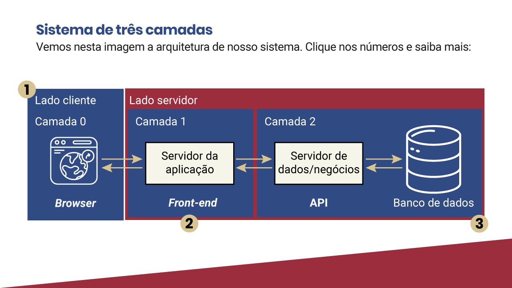
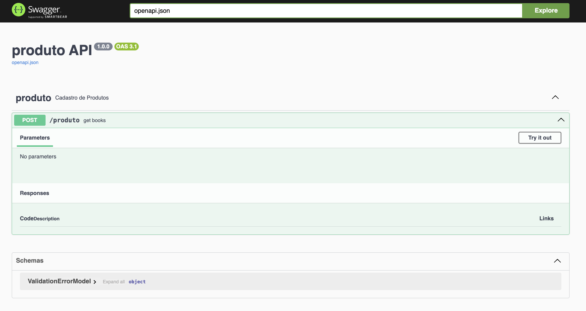
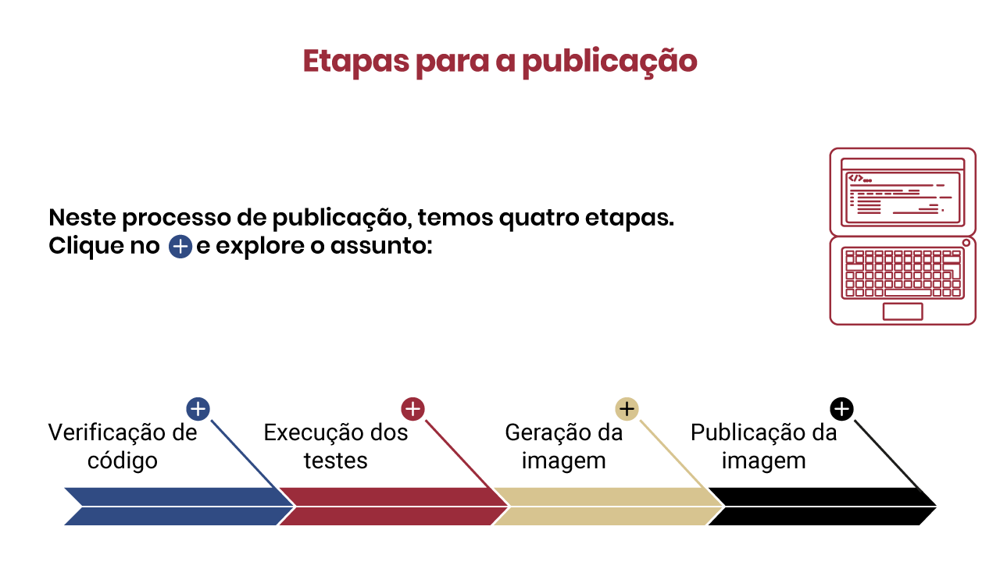
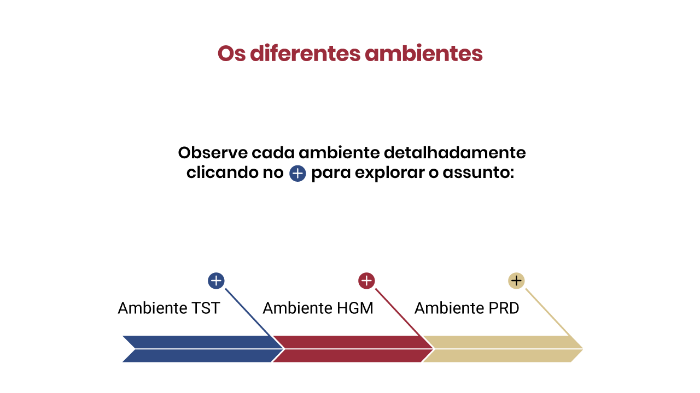

# Documentação e Deploy
---
- Conectando as partes: conectando camadas via API
    - Sistema 3 camadas
        
    - frontend
        ```javascript
        const onClickSubmitProduto = async (e: any) => {
            e.preventDefault();

            const data: IProduto = {
                nome: nome,
                quantidade: parseInt(quantidade),
                valor: parseInt(valor)
            }
            try {
                const response = await fetch('http://127.0.0.1:5000/produto', {
                    method: 'POST',
                    headers: {
                        'Content-Type': 'application/json;charset=utf-8',
                        'Access-Control-Allow-Origin': '*'
                    },
                    body: JSON.stringify(data)
                });
        
                if (!response.ok) {
                    throw new Error('Erro ao enviar a requisição.');
                }
        
                const responseData = await response.json();
                console.log('Resposta do servidor:', responseData);
            
                onSubmitProduto(responseData)
            } catch (error: any) {
                console.error('Erro ao enviar a requisição:', error.message);
            }
        }
        ```

        ```html
        <div>
            <input type="button" value="Salvar" onClick={onClickSubmitProduto}/>
        </div>
        ```

    - backend
        ```python
        @app.post("/produto")
        def create_produto():
            print("Iniciando cadastro de produto: " + str(request.get_json()) + "\n")
            data = request.get_json()
            nome = data["nome"]
            quantidade = data["quantidade"]
            valor = data["valor"]
            with connection:
                with connection.cursor() as cursor:
                    # Criando a tabela se caso não exisitr 
                    cursor.execute(CREATE_TABLE_PRODUTO)
                    
                    # Inserindo um produto na tabela
                    cursor.execute(INSERT_PRODUTO_RETURNING_ID, (nome, quantidade, valor))
                    produto_id = cursor.fetchone()[0]
                    print("\nProduto cadastrado com sucesso " + str(produto_id) + "\n")
                    cursor.connection.commit()
                    
                    # Consultando e retornando o objeto salvo
                    cursor.execute(SELECT_PRODUTO_BY_ID, (produto_id,))
                    produto_salvo = cursor.fetchall()[0]
                    produto_response = dict(zip([x[0] for x in cursor.description], produto_salvo))
                    produto_json = json.dumps(produto_response, indent=4, sort_keys=True, default=str)
                    
                    print("\nPRODUTO SALVO: " + str(produto_json) + "\n")

                return produto_json, 201
        ```

    - database
        ```sql
        INSERT INTO produto (nome, quantidade, valor) VALUES (%s, %s, %s) RETURNING id;
        ```
---
- Documentação
    - A documentação do código tem papel importante na garantia da legibilidade. É nela que parâmetros de entradas e saídas serão explicados e exemplificados, funções e classes terão suas existências justificadas e descrições de testes serão adicionadas. Tudo isso para garantir o máximo de informação para uma boa compreensão do código, permitindo o desenvolvimento colaborativo do software.

- Documentação de API
    - Como uma API é uma aplicação web, espera-se que siga todas as restrições e limitações de arquitetura discutidas na primeira aula. Retornando ao tema padrão MVC, a visualização é a parte do sistema que sabe manipular modelos para gerar visualizações coerentes com aquilo que foi definido pelo controlador.

- Usando Falsk-OpenAPI3
    - [Documentação: OpenApi - Swagger](https://pypi.org/project/flask-openapi3/)

        
---
- Publicação de uma aplicação
    - 4 Etapas e 3 ambientes
        
        