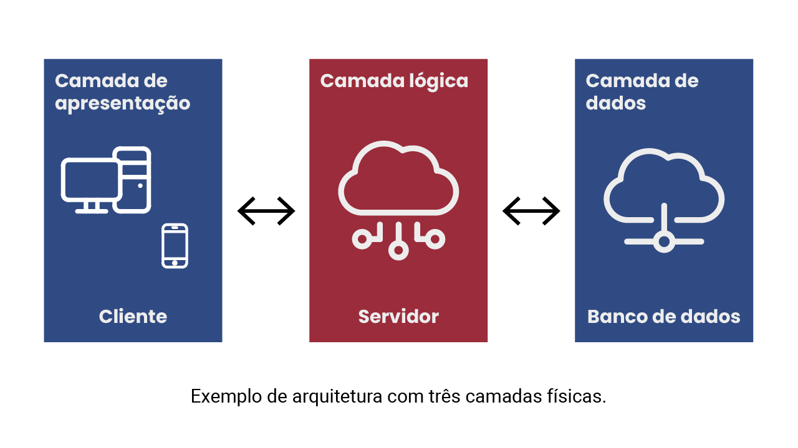
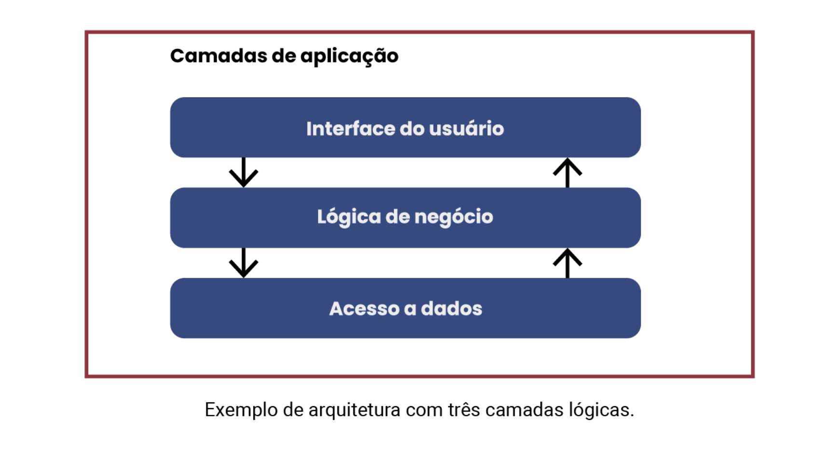
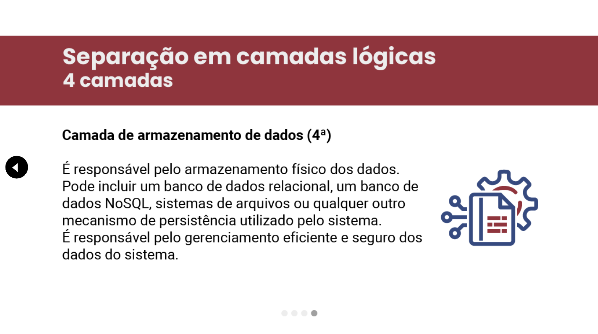
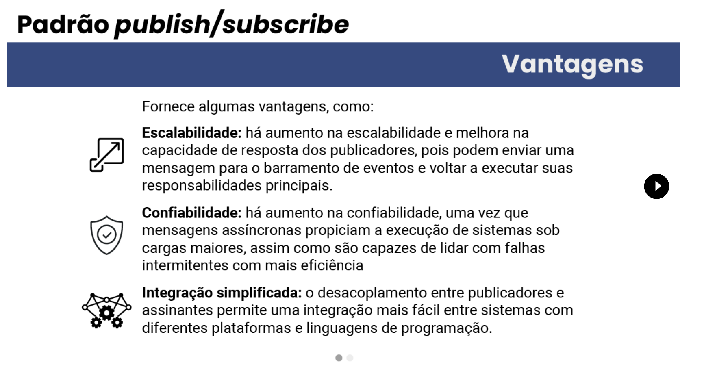

# Padrões Arquiteturais
---
- Conceitos básicos
    - A arquitetura de software é um conjunto de decisões de projeto que se refere ao planejamento da estrutura geral e organização de um sistema de software
        - 1 - Não se atém a detalhes de projeto detalhado ou implementação.
        - 2 - Satisfaz atributos de qualidade importantes, como reusabilidade e manutenibilidade.
    - Os padrões descrevem propositadamente soluções genéricas para que possam ser reutilizadas
    - Padrões arquiteturais fornecem soluções específicas para determinados problemas.
    - Estilos arquiteturais fornecem diretrizes gerais de arquitetura que não resolvem problemas específicos.
---
- Arquitetura cliente-servidor
    - No padrão arquitetural cliente-servidor, a computação é dividida entre várias máquinas.
    - A topologia desse padrão determina que componentes em uma máquina servidor forneçam funcionalidades para componentes em várias máquinas clientes por meio de uma conexão de rede. O servidor centraliza recursos computacionais, que podem ser compartilhados por muitos usuários, e os clientes desses recursos podem permanecer relativamente simples.
    - Na topologia cliente-servidor, o cliente é quem invoca as funcionalidades disponibilizadas pelo servidor. 
    - ### Vantagens
    
    - ### Desvantagens
    
---
- Padrão arquitetural em camadas
    - Padrão composto por um conjunto de duas ou mais camadas, organizadas hierarquicamente, que se comunicam entre si.
        - Padrão que determina a separação em camadas físicas (N-tier architecture)
            - As camadas são compostas por entidades físicas, como computadores pessoais, servidores ou dispositivos móveis.
            
        - Padrão em camadas que estabelece a separação de conceitos ou funcionalidades em camadas lógicas (layered architecture)
            - Cada camada separa um conceito ou funcionalidade. Eventualmente, as camadas podem estar alocadas em um mesmo equipamento de hardware. 
            
---
- Separação em camadas físicas
    - Certos sistemas de software têm uma única camada física (tier), isto é, todos os componentes de software do sistema estão localizados em um único dispositivo de hardware. Entre os exemplos, temos: aplicativos desktop, como o Office da Microsoft; alguns jogos para computadores pessoais; e softwares de edição de imagem, como Paint ou Photoshop.
    - A vantagem da camada física única é que os componentes desses sistemas não têm latência de rede para se comunicarem, já que todos estão localizados na mesma máquina. Isso aumenta o desempenho do software. Outra vantagem é a privacidade e segurança de dados, pois os dados do usuário sempre permanecem em sua máquina e não precisam ser transmitidos por uma rede para persistência. Por outro lado, uma grande desvantagem é a dificuldade de atualização do software. Depois que o software é enviado, nenhuma atualização de código ou recurso pode ser feita até que o cliente o atualize manualmente, conectando-se a algum servidor remoto ou baixando e instalando um patch.
---
- Separação em camadas lógicas
    - Uma arquitetura de camadas lógicas convencional em projetos web é aquela que segrega as funcionalidades do sistema em quatro camadas.
        - ### Camada de Apresentação
        
        - ### Camada de Negócios
        
        - ### Camada de Acesso a Dados
        
        - ### Camada de Armazenamento de Dados
        
---
- Padrão modelo-visualização-controlador (MVC)
    - Por meio da separação explícita das três camadas, esse padrão oferece aos desenvolvedores a capacidade de trabalhar de forma mais independente, especialmente no que diz respeito à manipulação da informação pelo programa e às representações das interações do usuário com essa informação.
    - A estrutura MVC fornece outros benefícios (mas não se limita a eles), como a facilidade de manutenção pela separação e o reuso de partes da aplicação.
---
- Arquitetura orientada a serviços (SOA) e microsserviços
    - Um serviço pode ser qualquer funcionalidade que conclui uma ação e fornece um resultado específico, como o processamento de pedidos de clientes ou a produção de um relatório de itens em estoque. Os serviços são combinados para criar novos sistemas 
- Microsserviços
    - O padrão baseado em microsserviços promove a construção de um sistema como um conjunto de microsserviços autônomos e independentes, isto é, que são executados como processos separados e podem ser implantados e dimensionados de forma independente.
    - Microsserviços utilizam protocolos leves de comunicação, como HTTP e REST, independentes de linguagem, e podem se comunicar de forma síncrona ou assíncrona. Além disso, instâncias de microsserviços podem ser adicionadas ou removidas conforme necessário, de acordo com a demanda do sistema.
    - De fato, uma das principais vantagens de uma arquitetura orientada a microsserviços é sua escalabilidade horizontal
        - Capacidade de aumentar a capacidade global do sistema pela adição de instâncias de um determinado serviço para melhor distribuir a carga maior deste
    - O uso de múltiplas instâncias do mesmo microsserviço pode contribuir para uma maior resiliência (ou confiabilidade) do sistema, pois, assim, este é capaz de lidar com as falhas individuais de cada instância.
---
- Padrões de arquitetura orientada a eventos
    - A arquitetura orientada a eventos é um padrão em que a comunicação entre os componentes é centrada na ocorrência de eventos. Os eventos representam alterações no estado do sistema, determinadas ações, entradas de dados dos usuários ou, mesmo, outras ocorrências relevantes. 
---
- Arquiteturas publish/subscribe
    - Os publicadores de eventos são remetentes de mensagens que representam as notificações de ocorrências de eventos. 
    - Os assinantes registram seus interesses em determinados tipos de eventos e são receptores de mensagens.
    - A comunicação entre publicadores e assinantes é intermediada por um barramento (ou broker) de eventos.
    - Os publicadores não precisam ter conhecimento dos assinantes: eles simplesmente emitem os eventos no barramento, que fica encarregado de notificar os assinantes. Os publicadores não se tornam cientes dos assinantes que foram notificados. Por outro lado, os assinantes expressam seus interesses e recebem notificações de eventos, sem ter conhecimento dos publicadores que os emitiram.
    - ### Vantagens
    
    - ### Desvantagens
    
---
- Arquitetura ponto a ponto (P2P, peer-to-peer)
    - Nesse padrão, os componentes individuais são conhecidos como pares. Os pares podem funcionar tanto como clientes, solicitando serviços de outros pares, quanto como servidores, fornecendo serviços a outros pares. Um par pode atuar como cliente, servidor ou ambos, e pode mudar seu papel dinamicamente com o tempo. Exemplos de uso dessa arquitetura incluem redes de compartilhamento de arquivos (como Gnutella e G2), protocolos multimídia e produtos baseados em criptomoedas.
---
- Arquitetura “quadro-negro” (blackboard)
    - Esse padrão arquitetural estabelece um modelo colaborativo em que componentes (agentes) especialistas contribuem com conhecimentos para resolver problemas complexos. Um componente central, chamado quadro-negro (blackboard), age como uma grande memória compartilhada, armazenando dados e conhecimentos disponibilizados para todos os agentes especialistas. Os agentes monitoram o blackboard, atualizando-o com informações relevantes. A colaboração entre os componentes ocorre de forma assíncrona. Um componente controlador toma decisões com base nas informações disponíveis, principalmente para selecionar, configurar e executar os agentes. Esse padrão é útil para problemas para os quais não são conhecidas estratégias de solução determinística, e algumas aplicações conhecidas são reconhecimento de fala e identificação e rastreamento de veículos.
---
- Arquitetura baseada em “dutos” e “filtros” (pipe-and-filter)
    - Nesse padrão, as tarefas são organizadas em uma sequência de estágios (pipeline), em que cada estágio executa uma parte específica do processamento de dados. Os dados fluem de um estágio para outro, permitindo o processamento em paralelo e a divisão das tarefas em partes menores e mais gerenciáveis. Existem dois tipos de componentes: filtros e dutos. Os filtros são os responsáveis pelo processamento dos dados em cada estágio e podem ser executados em paralelo, enquanto os dutos fornecem a estrutura que permite a passagem contínua dos dados de um estágio para outro. Os dutos permitem armazenar temporariamente os dados, enquanto não são obtidos pelo próximo filtro. Exemplos de sistemas que podem seguir esse padrão arquitetural são alguns compiladores, em que os filtros realizam análise léxica, análise sintática, análise semântica e geração de código.