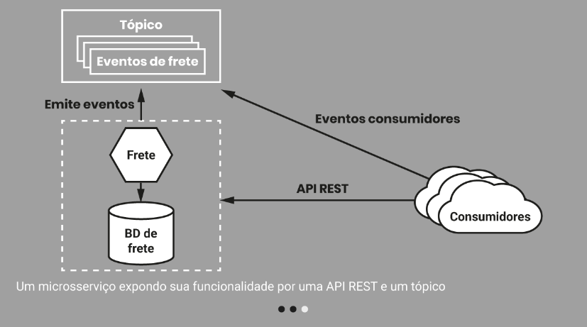

# Introdução à Arquitetura de Microsserviços
- O que é arquitetura de software?
    - Uma visão geral do sistema a partir de um zoom-out que permite enxergar sua estrutura: os componentes maiores que o compõem e como esses componentes se comunicam.
    - “Componente” refere-se a um conjunto de módulos, e “módulo” refere-se a um agregado de funções e dados
    - A estrutura corresponde ao projeto dos componentes e módulos – o design – do sistema
    - A infraestrutura é composta por tudo aquilo que apoia o projeto
    - Arquitetura em arquitetura de microsserviços refere-se tanto à maneira como estruturamos o código do sistema quanto a aspectos de infraestrutura.
---
- O que são microsserviços?
    - Os microsserviços são serviços modelados em torno de um domínio de negócios que podem ser lançados e implantados ​​independentemente. Eles são um tipo de arquitetura orientada a serviços, embora tenham 'opiniões fortes' sobre como os limites de cada serviço devem ser traçados e nos quais a capacidade de implantação independente é fundamental. Eles são agnósticos à tecnologia, o que é uma das vantagens que oferecem.
    - Do lado de fora, um único microsserviço é tratado como um componente caixa-preta. Ele hospeda a funcionalidade de negócios em um ou mais endpoints de rede (por exemplo, uma fila ou uma API REST, conforme mostrado na figura a seguir), sobre quaisquer protocolos apropriados. Os consumidores, sejam eles outros microsserviços ou outros tipos de programas que consomem algo produzido pelo serviço, acessam a funcionalidade oferecida pelo serviço por meio desses endpoints. Os detalhes internos da implementação (como a tecnologia em que o serviço é escrito ou a forma como os dados são armazenados) são totalmente ocultos do mundo externo.
        
    - As arquiteturas de microsserviços evitam o uso de bancos de dados compartilhados na maioria das circunstâncias. Em vez disso, cada microsserviço encapsula seu próprio banco de dados, quando este é necessário.
---
- Principais conceitos relacionados com os microsserviços
    - Implatação independente
    - Modelagem sobre um domínio de negócios
    - Gerenciamento do próprio estado
    - Tamanho do microserviço
    - Flexibilidade
    - Alinhamento de arquitetura com organização
---
- Vantagens da arquitetura de microsserviços
    - Heterogeneidade de tecnologia
        - Facilidade com uso de multiplas tecnologias
    - Robustez
        - Facilmente poder isolar problemas
    - Escala
        - Escala isolada para utilizar menos ou mais instancias conforme a necessidade do microserviço
    - Facilidade de implantação
        - Implantação de apenas um microserviço
    - Alinhamento organizacional
        - Organização
    - Facilidade de composição
        - Facilidade de reutilização de funcionalidades
---
- Como projetar microsserviços
    - Ocultação de informação
        - A ocultação de informações visa a esconder detalhes complexos dentro de um limite de módulo/componente ou microsserviço
    - Coesão
        - Coesão se refere ao grau no qual os elementos dentro de um componente ou módulo estão inter-relacionados e compartilham um objetivo comum. Seja uma classe, um pacote ou um microsserviço, o princípio permanece o mesmo: “Código que muda junto permanece junto.”
    - Acoplamento
        - O baixo acoplamento entre serviços é crucial em uma arquitetura de microsserviços. Ele garante que uma alteração em um serviço não exija alterações em outros, permitindo a implantação independente.
        - No contexto de microsserviços, podemos ter quatro tipos de acoplamento: acoplamento de domínio, acoplamento de passagem, acoplamento comum e acoplamento de conteúdo. Esses tipos de acoplamento estão listados em ordem de mais fraco para mais forte.
---
- Domain-driven design no projeto de microsserviços
    - A linguagem ubíqua é a prática de usar a mesma terminologia utilizada pelos usuários do sistema em nosso código. O objetivo é estabelecer uma linguagem comum entre a equipe de desenvolvimento e os usuários finais
    - Agregado, considere um agregado como uma representação de um conceito real de domínio – pense em algo como um pedido, uma fatura, um aluguel, um item de estoque, e assim por diante. Os agregados geralmente têm um ciclo de vida, o que faz com que possam ser implementados como uma máquina de estado. Por exemplo, um agregado de Pedido pode conter vários itens (imagine um pedido em uma loja de móveis que inclui três sofás e uma cadeira – cada par quantidade x produto é um item do pedido). 
    - Um contexto delimitado geralmente representa um limite organizacional de mais alto nível, envolvendo possivelmente múltiplos agregados.