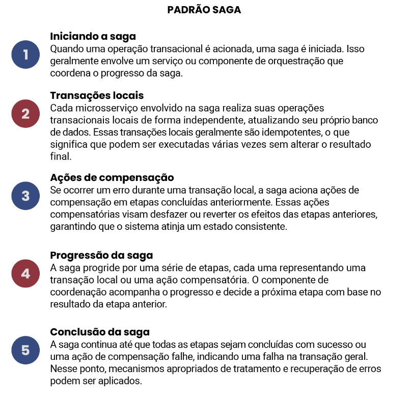
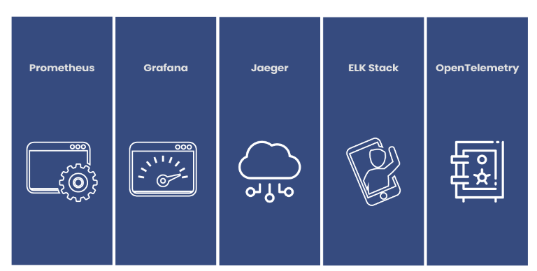

# Implementando Uma Arquitetura de Microsserviços
- Comunicação entre microsserviços
    - Existem mecanismos de comunicação síncronos bloqueantes e assíncronos não bloqueantes. Existem, também, de maneira geral, três estilos diferentes de colaboração request-response (requisição-resposta), dirigidos a eventos e com uso de dados compartilhados.
    - Em geral, o estilo de comunicação request-response é implementado utilizando o padrão arquitetural REST (Representational State Transfer) com o protocolo HTTP (Hypertext Transfer Protocol). Porém, como alternativa, mais recentemente surgiu o GraphQL, uma linguagem de consulta criada pelo Facebook em 2012 e lançada publicamente em 2015. A principal diferença entre o GraphQL e o REST é que o primeiro permite incluir consultas na requisição, o que pode facilitar o acesso a subconjuntos de dados na comunicação. Os dados retornados com REST são sempre predefinidos, ou seja, se for necessário construir uma requisição que acessa um subconjunto – ou superconjunto – de dados, é necessário criar outro endpoint específico para essa comunicação. Além disso, como o GraphQL permite que o cliente defina consultas nos dados, isso também pode evitar a realização de múltiplas requisições para recuperar a mesma informação. Além disso, pode impactar a performance, favorecendo uma otimização de requisições, o que é muito interessante para clientes mais restritos, como apps rodando em um celular. Mesmo assim, o padrão REST sobre HTTP continua sendo a implementação mais popular do estilo request-response.
    - RPC (Remote Procedure Call, ou Chamada Remota a Procedimento) refere-se à técnica de realizar uma chamada local e fazer com que ela seja executada em algum serviço remoto. Ou seja, para o programador, ele aparentemente só está realizando uma chamada a uma função local – no código, é como uma chamada local mesmo, mas essa chamada acionará uma requisição a um serviço remoto.
---
- Fluxo de trabalhos
    - Atomicidade
        - Garante que todas as operações dentro de uma transação sejam concluídas com sucesso ou nenhuma delas entre em vigor. Se alguma alteração falhar, toda a transação será revertida, deixando o banco de dados inalterado.
    - Consistência
        - Garante que o banco de dados permaneça em um estado válido e consistente após a execução de uma transação, obedecendo a regras e restrições predefinidas
    - Isolamento
        - Permite que várias transações operem simultanemanete sem haver interferência entre elas. Alterações temporárias feitas em uma transação são isoladas de outras transações até que as alterações sejam confirmadas.
    - Durabilidade
        - Garante que, uma vez que uma transção seja confirmada e concluída, suas alterações sejam permanentemente armazeandas e protegidas contra falhas ou travamentos do sistema.
    - Um microsserviço pode realizar transações ACID em seu próprio banco de dados local. Entretanto, algumas operações podem envolver alterações em bancos de um conjunto de microsserviços. É aí que entra a dificuldade em manter a consistência dos dados, uma vez que temos um conjunto de bancos de dados envolvidos na operação, e não somente um microsserviço realizando alterações locais em seu próprio conjunto de dados. Uma das maneiras de contornar esse problema é utilizar transações distribuídas que usam algoritmos como o de commit de duas fases (2PC – two-phase-commit).
    - O uso de commits de duas fases e transações distribuídas no contexto de microsserviços apresenta os seguintes desafios: maior complexidade, impacto no desempenho, limitações de escalabilidade, acoplamento entre serviços, ponto único de falha, riscos de impasse distribuído – deadlocks – e problemas de consistência.
    - Esses fatores podem prejudicar a escalabilidade, a capacidade de resposta e a resiliência do sistema. Consequentemente, muitas organizações exploram abordagens alternativas, como transações de compensação, arquiteturas orientadas a eventos ou eventuais padrões de consistência para enfrentar esses desafios e fornecer soluções mais flexíveis e escaláveis ​​para microsserviços.
    - Uma das soluções mais populares e recomendadas por especialistas, como Sam Newman, é o padrão SAGA. Ele visa lidar com transações complexas e de longa duração, dividindo-as em uma série de etapas ou estágios menores e fracamente acoplados, conhecidos como “sagas”.
    - No padrão SAGA, cada microsserviço envolvido na transação é responsável por suas operações transacionais locais e mantém seu próprio banco de dados. Em vez de uma única transação atômica abrangendo vários serviços, uma saga coordena uma sequência de transações locais, cada uma dentro de seu próprio limite de microsserviço.
---
- Padrão SAGA
    
---
- Build, implantação e teste de sistemas baseados em microsserviços
    - Integração contínua
        - A integração contínua (CI – continuous integration) é uma prática bem estabelecida que garante a frequente integração e sincronização de código entre desenvolvedores. A integração contínua consiste em realizar frequentemente o merge das alterações de código em um repositório compartilhado, e validá-las automaticamente por meio de compilações e testes automatizados.
        - Ela envolve um servidor CI que detecta commits de código, realiza verificações como compilação e testes, e cria artefatos para validação posterior. Esses artefatos são armazenados em um repositório para permitir a reutilização e confirmar se os artefatos implantados correspondem aos testados.
        - A CI oferece vários benefícios, incluindo feedback rápido sobre a qualidade do código, criação automatizada de artefatos, rastreabilidade entre artefatos e código e capacidade de controlar a versão da configuração da infraestrutura juntamente com o código do microsserviço.
---
- Pipelines de build
    - As pipelines de build envolvem a divisão do processo de build em vários estágios para melhorar a eficiência e fornecer valioso feedback no processo.
    - Essa abordagem é particularmente útil ao lidar com diferentes tipos de testes, como testes rápidos e de escopo pequeno versus testes lentos e de escopo grande (por exemplo, testes de integração que envolvam banco de dados).
    - Ao separar os testes em estágios distintos em uma pipeline de build, torna-se possível priorizar testes rápidos para um feedback mais rápido. Se os testes rápidos falharem, não há necessidade de prosseguir com os testes mais lentos.
    - O conceito de pipeline de build permite monitorar o progresso da alteração de software à medida que ela passa por cada estágio, fornecendo informações sobre sua qualidade.
---
- Entrega contínua e implantação contínua
    - Dado que temos uma pipeline de build que roda cada vez que integramos alguma implementação nova de nosso microsserviço, se nesse processo há implantação automática das alterações em produção, então estamos realizando o que é chamado de implantação contínua (continuous deploy). Se, por outro lado, não fazemos a implantação automática, mas a cada alteração deixamos o nosso microsserviço em um estado que nos permita fazer a implantação quando quisermos, então estamos falando de entrega contínua (continuous delivery). Com a junção das integrações frequentes – a integração contínua – com a prática de sempre deixarmos nosso sistema pronto para a implementação – a continuous delivery –, temos o que é comumente conhecido, em nossa indústria, como CI/CD.
    - É importante que fique claro que não é possível realizar CI/CD sem uma boa base de testes automatizados, pois é essa base que vai garantir a possibilidade de se integrar e implantar frequentemente com confiança.
---
- Implantação de microsserviços
    - Execução Isolada
        - Execute as instancias dos microsserviços isoladamente, garantindo que tenham recursos de computacao dedicados.
    - Foco na automação
        - Foque em automacao a medida que o numero de microsserviços cresce. Escolha a tecnologia que permite um alto nivel de automacao.
    - Infraestrutura como codigo
        - Represente a configuracao da infraestrutura por meio de codigo para facilitar a automacao e o compartilhamento de informacoes. Armazene esse codigo no controle de versao para facilitar a recriacao de ambientes.
    - Implatação com tempo de inatividade zero
        - Habilite a implantação continua de novas versoes de microservicos sem qualquer interrupcao para os usuarios.
    - Gerenciamento de estado desejado
        - Utiliza uma plataforma que mantem os microservicos em um estado definido. Inicie novas instancias conforme necessario.
---
- Teste em uma arquitetura de microsserviços
    - Os testes de contrato nos permitem definir as interações esperadas entre nossos serviços com base em seus requisitos de entrada e saída.
    - Os testes de contrato envolvem uma equipe responsável por um microsserviço que depende de um serviço externo. Esses testes são projetados para descrever o comportamento esperado do serviço externo, em vez de focar o teste do próprio microsserviço.
---
- Monitoramento e observabilidade
    - Insturmentacao adequada para métricas, logs e rastreamento
    - Centralização de logs e métricas
    - Monitoramento em tempo real
    - Tecnicas de rastreamento distribuído
    - Analise de dados e aprendizado de maquina
    
---
- Segurança, resiliência e escalabilidade
    - Princípio do privilégio mínimo; defesa em profundidade; automação; e inclusão de segurança no processo de entrega. Esses princípios são essenciais para garantir a proteção adequada dos sistemas.