# Introdução e DevOps: Primeira Maneira (fluxo)
- DevOps
    - A automação (DevOps) contribui não só para o aumento da qualidade, mas para a aceleração de tarefas repetitivas e manuais.
    - O objetivo do DevOps é tornar os processos mais simples, integrar desenvolvedores e profissionais de infraestruturas, unir equipes e aumentar as entregas aos clientes, agregando velocidade e qualidade a elas.
    
    - Com base na colaboração dessas equipes e em um conjunto de ferramentas, a tecnologia e as abordagens ágeis permitem às equipes criar uma cultura de colaboração para fugir dos desperdícios e impedimentos automatizando processos: 50% automação e 50% colaboração.
    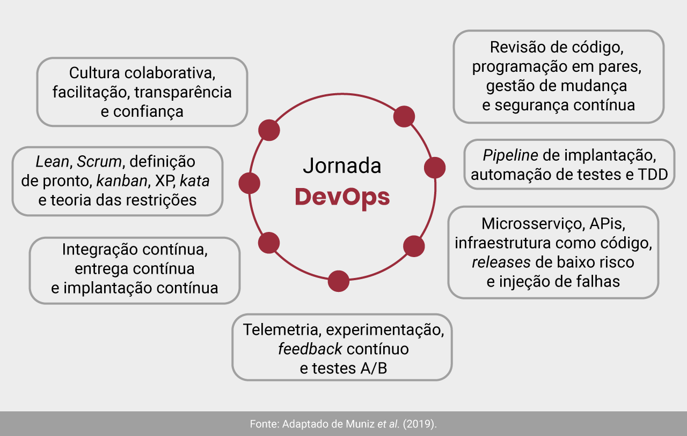
    - 1 Maneira
        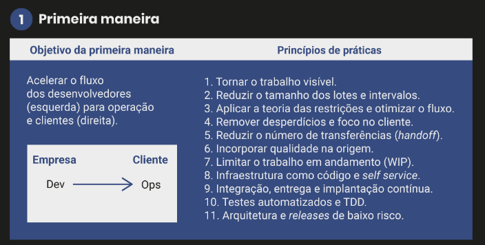
    - 2 Maneira
        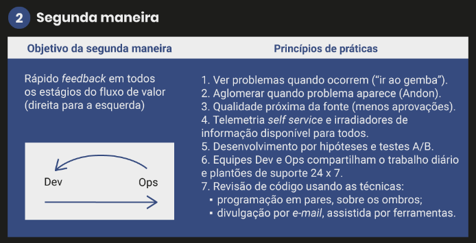
    - 3 Maneira
        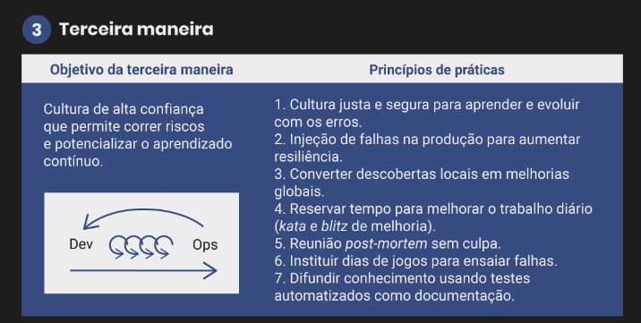
---
- DevOps: primeira maneira
    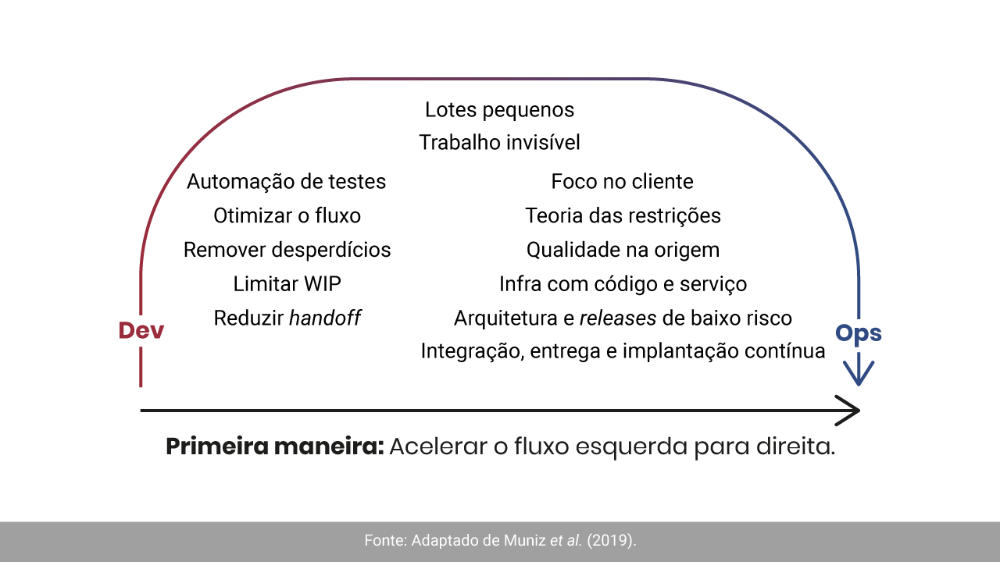
    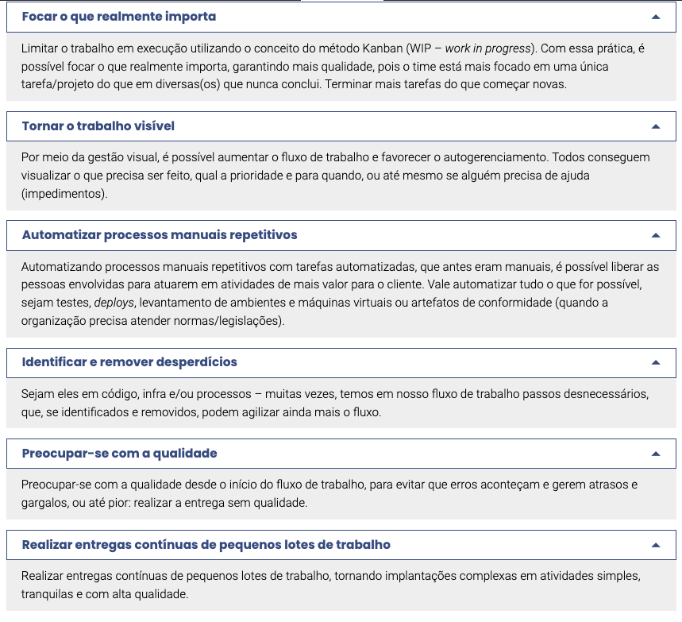
---
- O que é pipeline de implantação?
    - Pipeline de implantação é o processo de automação do fluxo de valor que leva o software do controle de versão até o ambiente de produção, passando pela integração contínua. Seu objetivo principal é fornecer feedback rápido a todos no fluxo de valor sobre o status das mudanças (principalmente para a equipe Dev). Por isso, colabora com a correção imediata quando algum problema ocorre.
    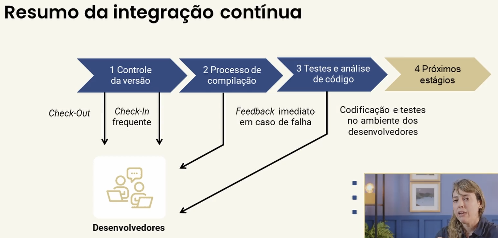
---
- Arquitetura em nuvem (IaaS, SaaS e PaaS)
    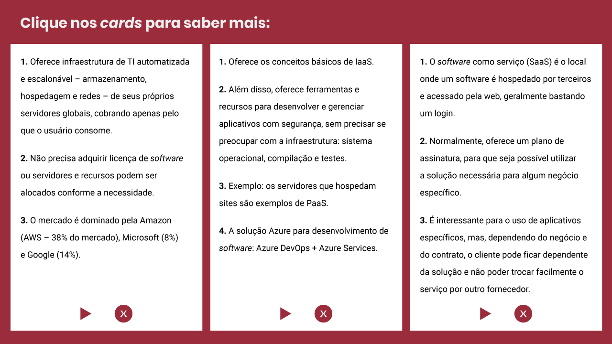
    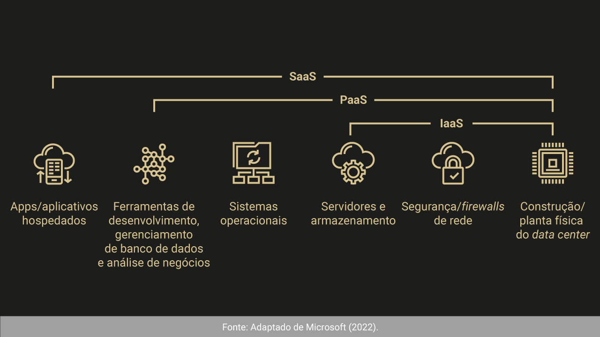
---
- Vantagens do PaaS
    - Reduz o tempo de codificação e facilita a gestão de capacidade, pois nessa plataforma existem componentes de aplicativos pré-codificados, como: fluxo de trabalho, serviços de diretório, recursos de segurança, pesquisa, etc.
    - Desenvolvimento simplificado para diversas plataformas, incluindo aplicativos móveis. Nesse sentido, alguns provedores fornecem opções de desenvolvimento para diversas plataformas, como computadores, dispositivos móveis e navegadores, tornando aplicativos de plataforma cruzada mais rápidos e fáceis de serem desenvolvidos. Lógico que existe o contraponto da dependência tecnológica da plataforma, por isso o custo x benefício precisa ser sempre analisado.
    - Um modelo pago, conforme o uso, permite que pessoas ou organizações usem um software de desenvolvimento e ferramentas de análise e business intelligence sem a necessidade de comprar o produto por completo, levando, em alguns casos, a economia de licenças. De qualquer forma, antes de tomar essa decisão, faça as contas. Um arquiteto cloud deve estar sempre com uma calculadora, pois, em alguns cenários, versões on-premise e híbridas podem ser mais vantajosas.
    - Como o ambiente de desenvolvimento é acessado pela internet, equipes de desenvolvimento podem trabalhar em conjunto sem problemas, mesmo quando existem times geograficamente distribuídos.
    - A estrutura PaaS fornece todas as funcionalidades para o suporte ao ciclo de vida completo de um aplicativo web. Por exemplo: compilação, teste, implantação, gerenciamento e atualização no mesmo ambiente integrado.
---
- O conceito de serverless
    - Os principais frameworks do mercado são:
        - Node.js: o serverless é um framework web e open source.
            - Inicialmente, era destinado exclusivamente para a criação de aplicações para o AWS Lambda, a plataforma da Amazon Web Services de serverless cloud computing.
            - Agora, está compatibilizado com outros fornecedores de cloud: Microsoft Azure, IBM BlueMix, Google Cloud e Oracle Cloud, entre outros.
        - Up: também é um framework open source.
            - Não tem funcionalidades.
            - Adapta seu código para rodar na arquitetura serverless.
---
- Testes automatizados, branching e releases de baixo risco
    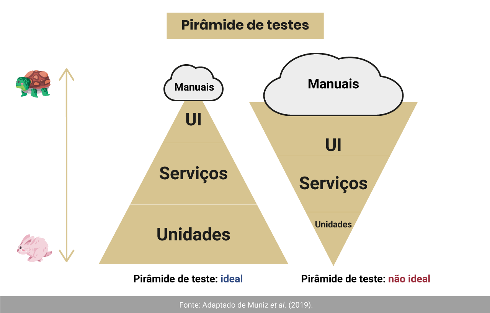
---
- Estratégia de branching
    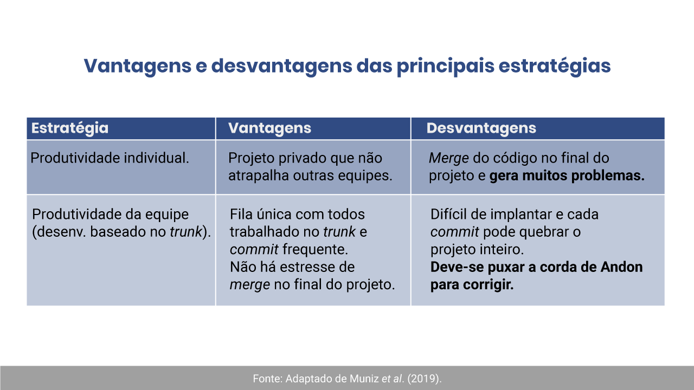
---
- Categorias de liberação (release)
    - É importante que o time planeje a release, ou a implantação de um pacote, e defina, junto com a operação, formas de reversão do deploy (plano de contingência), caso se detecte algum problema. Exemplos de reversão são: release canário (implantar a versão anterior) ou alternância de recursos/feature toggle (incluir na aplicação uma função de ligar/desligar a funcionalidade sem precisar voltar à versão anterior à implantação).
---
- O que é “alternância de recursos” (feature toggle)
    - Habilita e desabilita recursos da aplicação, de acordo com critérios definidos (ex.: funcionário e localidade).
    - Usa instrução condicional por meio de parâmetros ou configuração, sem necessidade de deploy.
    - Permite lançamento escuro:
        - Implantação de recursos na produção para avaliar resultados, sem o usuário perceber.