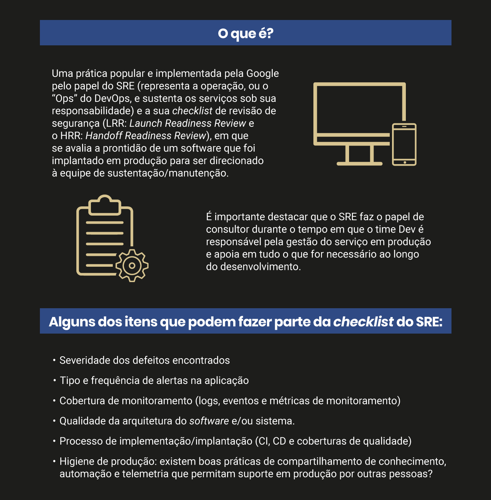

# Segunda Maneira: Rápido Feedback
- Telemetria
    - É a coleta remota e automática de dados para monitorar a saúde das aplicações e de seus ambientes. A telemetria apoia, também, a análise do risco de liberação de versões em desenvolvimento/homologação e/ou produção com o feedback de eventos, métricas e registros em toda a cadeia do fluxo.
    - Para que seja possível um rápido feedback, é fundamental que tenhamos o conceito de telemetria self-service, ou seja, indicadores disponíveis para todos os envolvidos no fluxo (incluindo o cliente), democratizando esse tipo de feedback. A cultura de métrica deve ser incluída no dia a dia de todas as equipes.
---
- Gemba
    - Gemba é um conceito que vem do lean e significa “ir e ver” com os seus próprios olhos o que está acontecendo para propor melhorias e/ou ajustes.
---
- Corda de andon
    - Usada na Toyota, significa a junção de todos do time para resolver (e não com o foco de procurar culpados) sempre que um problema é detectado ao longo do fluxo. Essa prática não só favorece a resolução de problemas críticos como também potencializa o sentimento de pertencimento e de que todos são os donos da solução, além de que o time sempre pensa melhor do que só uma pessoa.
---
- Plantão 24 x7 compartilhado
    - 
---
- Testes A/B
    - Usar a técnica praticada pelo marketing favorece o rápido feedback e o desenvolvimento de pequenos lotes, ou até mesmo o não desenvolvimento (código), e a utilização de formulários e pesquisas para entender se realmente é algo que o cliente quer que seja ser desenvolvido, evitando, assim, desperdícios de tempo e de recursos (incluindo desperdício de código).
---
- Revisão de código (pull request)
    - Uma das formas mais comuns de revisão de código é o pull request (PR), em que o desenvolvedor solicita revisão de forma colaborativa após concluir uma mudança no código. 