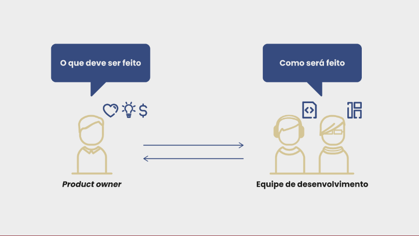

# Scrum essencial

- Scrum: papéis, cerimônias e artefatos
    - O Scrum é um framework de gestão ágil que utiliza tempo fixo (sprints) em vez de escopo fixo para determinar seus incrementos
---
- Pilares do Scrum
    - Transparência
    - Inspeção
    - Adaptação

    
---
- Processos do Scrum
    - Papéis
        - PO
            - O product owner, por sua vez, é responsável pela produção e gestão ágil dos requisitos para o produto. Ele foca no retorno de investimento (RoI) e no valor agregado para o cliente. Ele é o único que edita e gerencia o backlog do produto.
            - Produto
            - Equipe de desenvolvimento
            - Backlog do produto
            - Visão
            - Interessados
            - Objetivos de negócio
        - Scrum Master
        - Equipe de Desenvolvimento
    - Cerimônias
        - Sprint
        - Planejamento da Sprint
        - Reunião diária
        - Desenvolvimento da Sprint
        - Revisão da Sprint
        - Retrospectiva do Sprint
        - Refinamento do Backlog
    - Artefatos
        - Backlog do Produto
        - Backlog do sprint
        - Incremento de produto potencialmente entregável
---
- Cerimônias do Scrum
    - O sprint corresponde a um período fixo de tempo (normalmente duas semanas) durante o qual um incremento utilizável do produto é criado.
    - Cerimônias: 
        - Planejamento do sprint
            - priorizar, entre os itens do backlog do produto, aqueles que devem ser desenvolvidos primeiro, analisar quais itens estão prontos para entrar no sprint e analisar o que pode ser incluído considerando as estimativas e a capacidade da equipe.
        - Desenvolvimento do sprint
            - Os membros da equipe de desenvolvimento definem seu próprio trabalho ao escolherem tarefas do sprint para realizar e devem se auto-organizar para alcançar o objetivo do sprint. Todo o desenvolvimento é acompanhado também pelo Scrum master e pelo PO em reuniões diárias da equipe Scrum.
        - Reunião diária
            - Reunião diária de cerca de 15 minutos 
            - 3 perguntas  
                - o que fiz ontem ?
                - o que vou fazer hoje ? 
                - tenho algum impedimento ?
        - Revisão do sprint
            - É uma atividade de inspeção e adaptação realizada no final do sprint para verificar o alcance dos objetivos do sprint.
        - Retrospectiva do sprint
            - Oportunidade para a equipe refletir sobre melhorias a serem aplicadas no próximo sprint.
        - Refinamento do backlog
            - Envolve preparar os itens do backlog do produto para sprints futuros, refinando-os durante o sprint corrente para satisfazer a definition of ready. A equipe de desenvolvimento deveria investir de 5 a 10% do seu tempo de sprint para apoiar o PO em atividades de refinamento do backlog.
---
- Artefatos do Scrum
    - Os artefatos do Scrum são o backlog do produto, o backlog do sprint e o incremento do produto potencialmente entregável gerado a cada novo sprint.
    - PO
        - Como deve ser feito
    - Equipe de Desenvolvimento
        - Como será feito

---

- Definition of ready (preparado)
    - Descreve os requisitos que devem ser atendidos para que um item possa ser movido do backlog do produto para o backlog do sprint.
---
- Definition of done (feito)
    - Descreve os requisitos que devem ser atendidos para que um item possa ser considerado concluído.
---
- Estimativa e velocidade
    - Estimativa
        - Ideal days
            - Ideal days representam o número de pessoas-dia necessário para tratar um item do backlog. Note que o tempo ideal não é o mesmo que tempo decorrido.
        - Story points
            - Story points representam uma medida relativa de tamanho para itens de um backlog. Eles são afetados por diversos fatores, como a quantidade de funcionalidade a ser desenvolvida, a complexidade, riscos e incertezas, entre outros. Como a medida é relativa, para estimar com story points é preciso estabelecer uma referência para a comparação.
            
            
            
    - Velocidade
        - Velocidade é a quantidade de trabalho que a equipe consegue completar em um sprint.
---
- Aspectos avançados da gestão ágil de projetos
    - Na engenharia de software contínua, as práticas de BizDev, DevOps e experimentação contínua são os elos entre a estratégia de negócio, o desenvolvimento e a operação.
    - BizDev
        - As práticas de BizDev buscam o alinhamento entre a estratégia de negócio e o desenvolvimento
    - DevOps
        - As práticas de DevOps buscam o alinhamento entre o desenvolvimento e a operação
    - Experimentação contínua
        - Conhecida como teste A/B, trata o ciclo de retroalimentação da operação para a estratégia de negócio.
    - O teste das hipóteses de negócio com o software em operação é a experimentação contínua, fechando um ciclo de retroalimentação.
---
- Extra:
        - Somente o PO pode marcar um item do backlog como um todo como concluído
