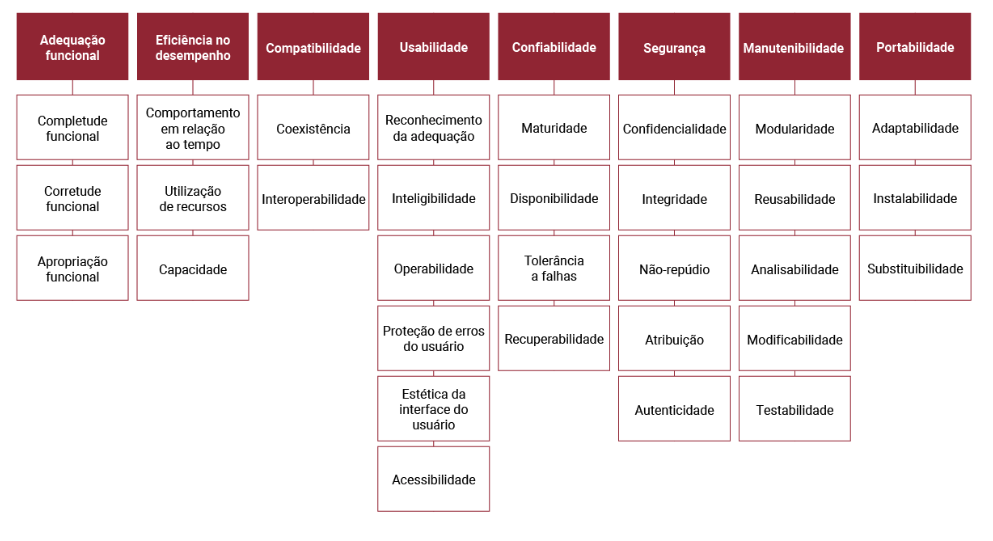
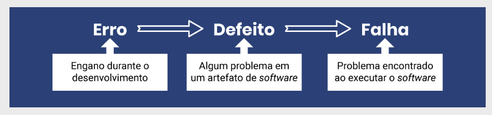
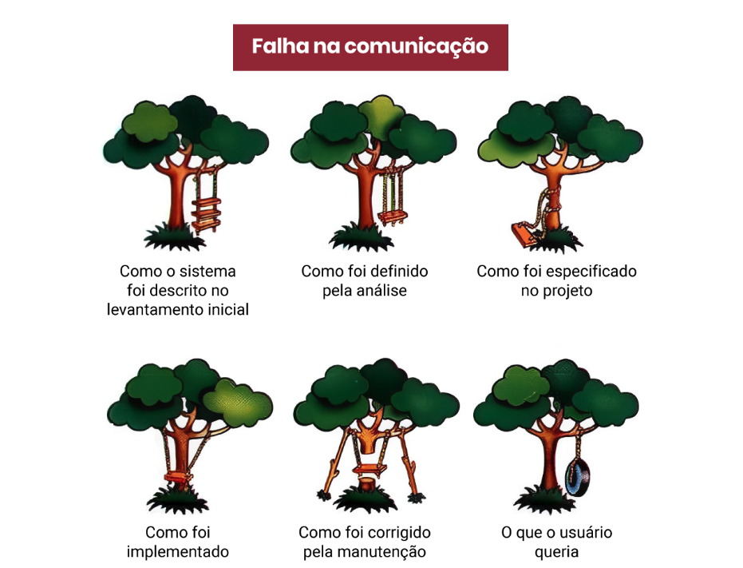
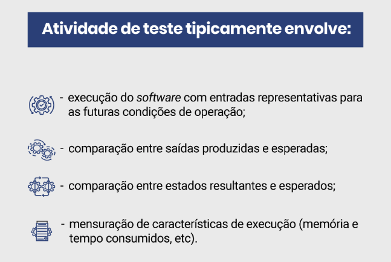
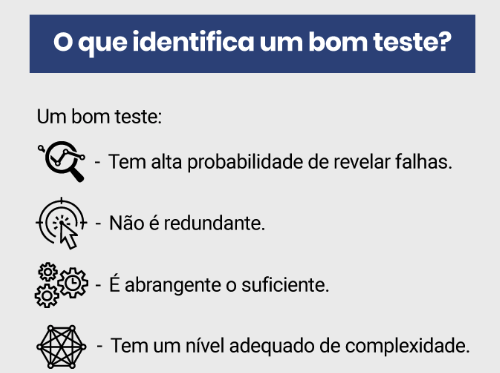

# Fundamentos e Técnicas Funcionais de Teste de Software
- Qualidade do produto de software
    - Caracteristicas de um produto de software
        - A norma ISO 25010 (Software Product Quality Model) contém um modelo para qualidade de produtos de software que contempla as características de qualidade de um produto de software e as diversas subcaracterísticas.
        
        
        
        - Note que apenas a primeira das características (adequação funcional) reflete os requisitos funcionais e diz respeito à funcionalidade do software. Entretanto, as outras sete características podem se mostrar tão importantes quanto as funcionalidades ou, dependendo do contexto, até mais importantes. Elas nos ajudam a definir requisitos não funcionais. Para poder avaliar e monitorar a qualidade do produto, é fundamental que os requisitos não funcionais sejam expressos de forma mensurável ou ao menos verificável, pois isso permitirá garantir e controlar a qualidade do produto em relação ao atendimento dos requisitos.

---
- Garantia da qualidade, controle da qualidade, verificação e validação
    - Garantia da qualidade:
        - A garantia da qualidade tem como propósito assegurar que os produtos de trabalho e a execução dos processos estejam em conformidade com os planos, procedimentos e padrões estabelecidos. Ou seja, ela avalia a conformidade do processo e do produto, visando a assegurar que os processos planejados foram implementados e que os produtos seguem os padrões pré-estabelecidos.

    - Controle da Qualidade
        - O controle da qualidade, por sua vez, corresponde à verificação e à validação do software. É aí que entram métodos de teste de software e revisões visando a encontrar defeitos naquele projeto específico.

    - Verificação
        - A verificação tem como propósito confirmar que cada produto atende apropriadamente aos requisitos especificados, ou seja, confirmar se o produto está sendo construído corretamente.
    
    - Validação
        - A validação tem como propósito confirmar que um produto ou componente do produto atenderá ao seu uso pretendido quando colocado no ambiente para o qual foi desenvolvido, ou seja, confirmar que estamos construindo o produto correto, aquele que de fato atende às necessidades do cliente.

---
- Diferenças entre Validação e Verificação
    - Na validação, a preocupação é garantir que o produto atende ao uso esperado, enquanto na verificação é garantir que ele atende aos requisitos especificados. A seguir, destacamos as similaridades e as diferenças da validação quando comparada à verificação.

---
- Defeitos de software
    - Para melhorar a qualidade de produtos de software, é preciso encontrar e corrigir defeitos.
     
     

---
- Teste de software: conceitos, fases e processo
    - Conceitos de teste de software
     - Teste de software pode ser definido como um processo de executar um software com o objetivo de revelar a presença de falhas, ou, falhando nesse objetivo, aumentar a confiança sobre o software.
      

---
- Elementos de Teste
    - Caso de teste
        - Descreve uma condição particular a ser testada e é composto por valores de entrada, restrições para a sua execução e um resultado ou comportamento esperado.
    
    - Procedimento ou roteiro de teste
        - Descreve os passos necessários para a execução de um ou grupos de casos de teste.

    - Critérios de cobertura dos testes
        - Permitem a identificação de partes do programa que devem ser executadas para garantir a qualidade do software e indicar quando ele foi suficientemente testado. A cobertura dos testes determina o percentual de elementos testados em um programa.

    - Rodada (bateria) de teste
        - Execução de todos os casos de teste para uma versão do produto em determinado ambiente. Uma nova rodada de teste deve ser executada caso o critério de aceitação do produto não tenha sido atingido.

    - Incidente de teste
        - Evento ou comportamento ocorrido durante a execução dos testes que requer investigação. Não há garantia de que todo incidente seja uma falha, pois ainda precisa ser analisado.

---
- Princípios de teste de software
    - Devem ser completamente planejados antes de seu início.
    - Os testes devem ser rastreáveis aos requisitos do usuário.
    - Para aumentar sua eficácia, os testes de sistema devem ser executados por equipes independentes. 
    - Não planeje o esforço de teste considerando que falhas não serão encontradas.
     

---
- Fases de teste de software
    - O teste unitário se refere à fase do processo de teste em que se testam as menores unidades de software desenvolvidas. 
    - O teste de integração envolve, a partir dos módulos testados no nível de unidade, testar a estrutura de programa que foi determinada pelo projeto. 
    - O teste de sistema envolve executar o sistema sob o ponto de vista de seu usuário final, varrendo as funcionalidades em busca de falhas. 
    - O teste de aceitação, eventualmente também chamado de homologação, é realizado pelo cliente.

---
- Técnicas de teste
    - As técnicas de teste se dividem nas seguintes categorias:

        - funcional (ou caixa preta/caixa fechada);
        - estrutural (ou caixa branca/caixa aberta);
        - baseada em defeitos.
    
    - A questão não está em qual delas utilizar, e sim em como combiná-las de forma a maximizar os benefícios das atividades de teste. Nesta aula, veremos exemplos de técnicas funcionais, que podem ser utilizadas na prática para elaborar casos de teste de sistema a partir de requisitos.

---
- 