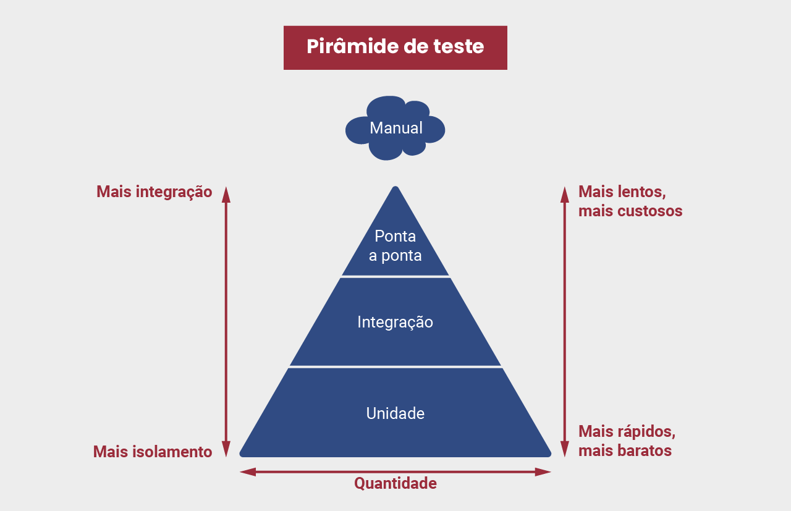
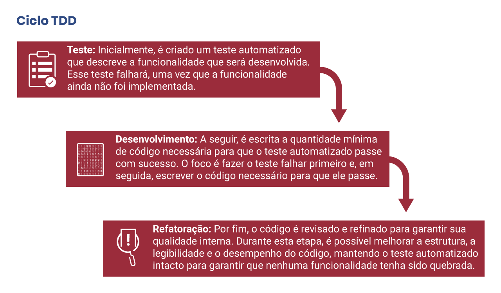

# Teste de Software na Prática e Desenvolvimento Guiado por Testes

- Pytest
    - O pytest é uma das ferramentas mais populares para escrever e executar testes automatizados em Python. Ele oferece uma sintaxe simples e clara para a criação de testes e dá apoio a uma ampla gama de tipos de testes, incluindo testes unitários, de integração e de aceitação. 

- Unittest
    - O unittest é um framework de teste embutido na biblioteca padrão do Python. Ele fornece uma estrutura para escrever testes e agrupá-los em classes de teste.

- Nose2 (nose)
    - O nose2, frequentemente referido como nose, é outro framework popular de teste automatizado para Python. Embora não seja mais mantido ativamente, muitos desenvolvedores ainda o utilizam.

- Piramede de testes
    

- Desenvolvimento guiado por testes
    - O desenvolvimento guiado por testes (TDD, sigla em inglês para Test-Driven Development) é uma abordagem de desenvolvimento de software que se baseia em um ciclo curto e iterativo. Nesse processo, os desenvolvedores escrevem testes automatizados antes de implementarem o código-fonte. É importante perceber que o TDD não é uma técnica de teste, e sim de desenvolvimento.
    
